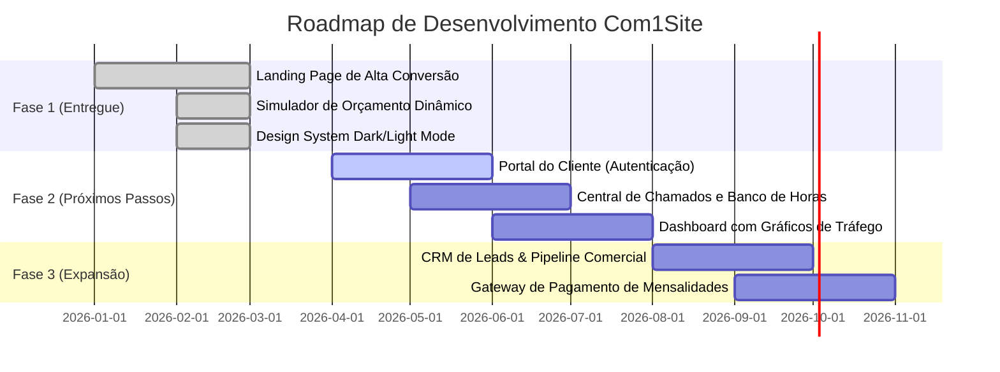

<div align="center">

  # 🚀 Com1Site
  ### Agência de Criação de Sites de Alta Performance & Gestão Web

  <p align="center">
    <strong>Landing page moderna, ultra-rápida e orientada à conversão máxima com simulador de orçamento em tempo real e arquitetura modular.</strong>
  </p>

  <p align="center">
    <a href="#-visão-geral">Visão Geral</a> •
    <a href="#-principais-recursos">Recursos</a> •
    <a href="#-demonstração-e-módulos">Módulos</a> •
    <a href="#-tecnologias">Tecnologias</a> •
    <a href="#-estrutura-do-projeto">Estrutura</a> •
    <a href="#-como-executar">Como Usar</a> •
    <a href="#-customização">Customização</a> •
    <a href="#-roadmap">Roadmap</a>
  </p>

  <p align="center">
    
    
    
    
    
    
  </p>

</div>

---

## 📌 Visão Geral

O **Com1Site** é uma plataforma institucional e de vendas de alto impacto desenvolvida para agências de criação, desenvolvimento e manutenção contínua de sites. 

Projetada sob o conceito **Dark Tech Premium / Glassmorphism**, ela alia uma experiência visual cativante a ferramentas interativas que aceleram a tomada de decisão do cliente — incluindo **simulador dinâmico de orçamento**, **modal de prévia do portal do cliente**, **portfólio filtrável com visualizador**, **notificações de prova social ao vivo** e **conversão direta para o WhatsApp**.

```
  ┌────────────────────────────────────────────────────────────────────────┐
  │                           COM1SITE ECOSYSTEM                           │
  ├───────────────────┬──────────────────────────────┬─────────────────────┤
  │ 🎨 FRONTEND UX    │ ⚡ SIMULADOR & CONVERSÃO      │ 🛡️ PLANOS MENSAIS   │
  │ • Dark/Light Mode │ • Cálculo em Tempo Real      │ • Essencial         │
  │ • Glassmorphism   │ • Geração de Link WhatsApp   │ • Pro               │
  │ • Micro-interações│ • Prova Social Dinâmica      │ • Enterprise        │
  └───────────────────┴──────────────────────────────┴─────────────────────┘
```

---

## ✨ Principais Recursos

### 🎛️ Experiência e Interface do Usuário (UI/UX)
- 🌓 **Tema Dual (Dark / Light Mode)**: Suporte completo a alternância de tema com persistência automática no `localStorage`.
- 💎 **Design System Customizado**: Variáveis CSS modulares para cores, sombras de neon, efeitos de vidro (*glassmorphism*) e tipografia moderna.
- 📱 **Mobile-First & Ultra Responsivo**: Layout 100% adaptável para smartphones, tablets, notebooks e monitores ultrawide.
- 🎬 **Animações de Entrada e Contadores**: Intersection Observer para revelação suave de elementos e contadores numéricos animados ao rolar a página.

### 💼 Ferramentas de Conversão e Vendas
- 🧮 **Simulador de Orçamento Interativo**:
  - Escolha do tipo de projeto (Landing Page, Institucional, E-commerce, Sistema Sob Medida).
  - Seleção de opcionais modulares (Otimização SEO, Blog/Artigos, Copywriting persuasivo, Integração CRM).
  - Inclusão opcional de plano de suporte/gestão mensal.
  - **Cálculo instantâneo** com resumo visual e botão de envio de proposta já formatada direto para o WhatsApp do atendente.
- 🔔 **Social Proof Toast (Prova Social em Tempo Real)**: Notificações flutuantes simulando novas contratações e orçamentos enviados por clientes recentes.
- 💬 **WhatsApp Float Button com Badge de Notificação**: Gatilho visual de alta conversão para atendimento rápido.
- ⚖️ **Comparador de Mercado**: Tabela visual comparando a Com1Site contra concorrentes genéricos e amadores.

### 📂 Portfólio & Demonstrações
- 🏷️ **Filtro de Projetos por Categoria**: Alternância instantânea entre Landing Pages, E-commerce, Corporativo e Portais.
- 🔍 **Modal de Detalhes do Projeto**: Visualização expandida com descrição técnica, tecnologias empregadas, tags e CTA de orçamento similar.
- 👤 **Modal Interativo "Área do Cliente"**: Simulação funcional do futuro portal do cliente (status de projeto, abertura de chamados e fatura).

---

## 🛠️ Tecnologias Utilizadas

Este projeto foi concebido com tecnologias puras e sem dependências pesadas, garantindo **máxima velocidade de carregamento (Core Web Vitals)** e **fácil manutenção**:

| Tecnologia | Descrição |
| :--- | :--- |
|  | Estrutura semântica, acessibilidade (ARIA), meta tags OpenGraph e Schema.org JSON-LD |
|  | Design System modular, Flexbox, CSS Grid, Custom Properties (CSS Variables) e Media Queries |
|  | Lógica reativa Vanilla ES6+, manipulação do DOM, eventos assíncronos e animações |

---

## 📁 Estrutura do Projeto

```bash
Com1Site/
│
├── index.html              # Estrutura completa da Landing Page e Modais
│
├── css/
│   ├── variables.css       # Tokens de design: paleta de cores, gradientes, fontes e sombras
│   ├── style.css           # Estilização global, componentes, navbar, simulador e modais
│   └── responsive.css      # Breakpoints responsivos para mobile, tablet e desktop
│
├── js/
│   ├── main.js             # Lógica do Simulador, Portfólio, Temas, FAQ e WhatsApp
│   └── animations.js       # Gatilhos de scroll, Intersection Observer e contadores
│
└── README.md               # Documentação completa do projeto
```

---

## 🚀 Como Executar Localmente

Como o projeto é construído em Vanilla Web (HTML/CSS/JS), você **não precisa instalar pacotes Node.js** para rodá-lo:

### Opção 1: Abrir diretamente no navegador
Basta dar um duplo clique no arquivo [`index.html`](file:///d:/FULLSTARK/Com1Site/index.html) ou arrastá-lo para uma aba do seu navegador preferido (Chrome, Edge, Firefox, Brave, Safari).

### Opção 2: Extensão Live Server (VS Code)
1. Instale a extensão **Live Server** no VS Code.
2. Clique com o botão direito em `index.html` e selecione **"Open with Live Server"**.
3. A página abrirá automaticamente no endereço `http://127.0.0.1:5500`.

### Opção 3: Usando Python (Terminal)
```bash
# Na raiz do projeto, execute:
python -m http.server 8000
# Acesse no navegador: http://localhost:8000
```

---

## ⚙️ Guia de Customização Rápida

### 1. Alterar o Número de WhatsApp para Recebimento de Leads
Substitua o número padrão (`5511999999999`) pelo seu WhatsApp com DDD e DDI:
- **No arquivo JavaScript**: Em [js/main.js](file:///d:/FULLSTARK/Com1Site/js/main.js), localize a constante/variável de telefone `5511999999999` e altere.
- **No arquivo HTML**: Em [index.html](file:///d:/FULLSTARK/Com1Site/index.html), busque por `5511999999999` nas tags de link e no botão flutuante.

### 2. Ajustar Preços e Pacotes do Simulador
Os valores do simulador são configurados dinamicamente no HTML através dos atributos `data-price`:
```html
<!-- Exemplo de item de projeto -->
<div class="sim-project-card" data-project="Landing Page" data-price="1200">...</div>

<!-- Exemplo de item adicional -->
<input type="checkbox" class="sim-addon-check" data-addon="Otimização SEO" data-price="400">
```

### 3. Personalizar Cores e Identidade Visual
Altere as variáveis em [css/variables.css](file:///d:/FULLSTARK/Com1Site/css/variables.css):
```css
:root {
  --primary-color: #6366F1;     /* Cor principal da marca */
  --primary-hover: #4F46E5;     /* Tom de hover */
  --accent-color:  #06B6D4;     /* Cor de destaque/glow */
  --success-color: #10B981;     /* Destaques de sucesso */
}
```

---

## 🗺️ Roadmap de Evolução



- [x] **Fase 1: Landing Page & Conversão**
  - [x] Design responsivo com Dark e Light Mode
  - [x] Simulador de orçamento com checkout para WhatsApp
  - [x] Portfólio com filtros e modais informativos
  - [x] Prova social e botões de contato inteligentes
  - [x] Otimização SEO (OpenGraph, Meta tags e Schema JSON-LD)
- [ ] **Fase 2: Portal do Cliente & Gestão**
  - [ ] Login e autenticação segura de clientes
  - [ ] Acompanhamento de progresso de criação do site em tempo real
  - [ ] Abertura de chamados de suporte técnico e solicitações de ajuste
  - [ ] Visualização de faturas e comprovantes de pagamento
- [ ] **Fase 3: Painel Administrativo & Automação**
  - [ ] CRM interno para gerenciamento de leads recebidos
  - [ ] Integração com gateways de pagamento (Pix / Cartão / Boleto)
  - [ ] Geração automática de propostas comerciais em PDF

---

## 📈 Performance e Boas Práticas

- ⚡ **Zero Framework Overhead**: Carregamento instantâneo sem peso de bibliotecas desnecessárias.
- 🔍 **SEO Semântico**: Hierarquia rigorosa de títulos (`H1` a `H4`), microdados Schema.org e tags canônicas.
- ♿ **Acessibilidade**: Contrastes validados, atributos `aria-label` em botões de ícone e navegação por teclado.

---

## 📄 Licença

Este projeto está sob a licença **MIT**. Veja o arquivo de licença para mais detalhes.

---

<div align="center">
  <sub>Desenvolvido com 💜 e foco em resultados por <strong>Com1Site</strong>.</sub>
</div>
